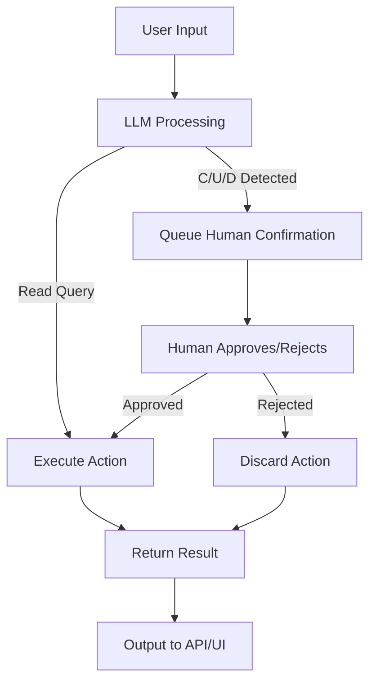

# 🤖 Mini agentic bot (LangGraph + LangChain)

A **mini agentic bot** built with **LangGraph** + **LangChain**, orchestrated with **FastAPI**, and deployed using **Docker + Streamlit UI**.  

This project demonstrates an **end-to-end agentic system** with:  
- Integration with **two mock databases** (MySQL for `Customers`, PostgreSQL for `Products`).  
- Support for **CRUD operations via natural language**.  
- **Human-in-the-loop (HITL)** confirmation for create/update/delete operations.  
- REST API exposure with **FastAPI**.  
- **Streamlit UI** for interactive exploration.  
- **Dockerized setup** with `docker-compose`.  

### DEMO VIDEO: 
https://www.loom.com/share/71e57b50d99a473cbec10ff86ebd8bf2?sid=29d0cac6-9803-4ba6-a8b3-7d769c75bcd6
---

## ✨ Features  

- 📊 **Customers Module** → Managed in **MySQL**.  
- 📦 **Products Module** → Managed in **PostgreSQL**.  
- 🔍 **Read operations (R)** → Results returned instantly.  
- ✍️ **Write operations (C/U/D)** → Require **human confirmation** before execution.  
- ⚡ **FastAPI endpoints** → REST APIs for both direct and agent-based interactions.  
- 🎛️ **LangGraph workflow** → Structured agent workflow with branching logic.  
- 🖥️ **Streamlit UI** → User-friendly interface for demo.  
- 🐳 **Dockerized deployment** → One command to spin up API, UI, and databases.  

---

## 🛠️ Tech Stack  

- **LangChain + LangGraph** → Agent + workflow orchestration.  
- **FastAPI** → REST API framework.  
- **SQLAlchemy** → Database connectivity.  
- **MySQL + PostgreSQL** → Mock databases.  
- **Streamlit** → UI layer.  
- **Docker & Docker Compose** → Containerization and multi-service orchestration.  

---

## 📂 Project Structure  

```bash

├── app/
│ ├── crud.py                               # CRUD functions for Customers & Products
│ ├── db_connections.py                     # SQLAlchemy DB connections
│ ├── human_loop.py                         # Human-in-the-loop action queue
│ ├── langchain_agent.py                    # LangChain agent + tools
│ ├── langgraph_workflow.py                 # LangGraph state machine workflow
│ ├── main.py                               # FastAPI app entrypoint
├ ├── test_connections.py                     # Test DB connectivity
│
├── ui.py                                   # Streamlit UI
├── docker-compose.yml                      # Multi-service setup
├── Dockerfile                              # API Dockerfile
├── Dockerfile.ui                           # UI Dockerfile
├── requirements.txt                        # Python dependencies
├── .env.example                            # Sample environment file

```

---

## 🔄 System Design  

### LangGraph Workflow  


- User Input → Natural language query.
- LLM Processing → Detects table (Customer/Product) and operation type.
- Human Confirmation → All C/U/D operations must be approved.
- Execution → Executes SQL query on respective DB.
- Output → Returns structured result to API/UI.

---

## 🚀 Getting Started

## 1️. Clone Repository
```
git clone https://github.com/DattatrayBodake25/genai-agentic-bot.git
cd mini-agentic-bot
```

## 2️. Setup Environment Variables
```bash
Create a .env file from .env.example:
cp .env.example .env
```
Update with real values:
```ini
# MySQL
MYSQL_USER=root
MYSQL_PASSWORD=your_mysql_password
MYSQL_HOST=mysql
MYSQL_DB=customer_db

# PostgreSQL
POSTGRES_USER=postgres
POSTGRES_PASSWORD=your_postgres_password
POSTGRES_HOST=postgres
POSTGRES_DB=product_db

# OpenAI
OPENAI_API_KEY=your_openai_api_key
```

---

## 3️. Run with Docker Compose
```bash
docker-compose up --build
```
- API → http://localhost:8000/docs
- UI → http://localhost:8501

---

## 📡 API Endpoints
### Health
```http
GET /health
```

### Customers
```http
GET    /customers?limit=10
GET    /customers?customer_id=1
POST   /customers
PUT    /customers/{id}
DELETE /customers/{id}
```

### Products
```http
GET    /products?limit=10
GET    /products?product_id=1
POST   /products
PUT    /products/{id}
DELETE /products/{id}
```

### Agent Interaction
```bash
POST /ask
{
  "question": "Show top 5 customers"
}
```

### Pending Actions (Human-in-Loop)
```bash
GET  /pending_actions
POST /pending_actions/approve/{index}
POST /pending_actions/reject/{index}
```

## 🖥️ Streamlit UI
- Customers tab → Browse MySQL customers.
- Products tab → Browse PostgreSQL products.
- Agent tab → Chat with the agent in natural language.
- Pending actions panel → Approve/Reject queued operations.

## 🧪 Testing
Check DB connectivity before running full workflow:
```bash
python test_connections.py
```

---

## 🐳 Run with Prebuilt Docker Images
Instead of building locally, you can pull the prebuilt images from Docker Hub:
```bash
# UI (Streamlit)
docker pull dattatraybodake/genai_agent_bot-ui
```
```bash
# API (FastAPI)
docker pull dattatraybodake/genai_agent_bot-api
```
Then run them with:
```bash
# Run API
docker run -d -p 8000:8000 --env-file .env dattatraybodake/genai_agent_bot-api
```
```bash
# Run UI
docker run -d -p 8501:8501 --env-file .env dattatraybodake/genai_agent_bot-ui
``` 
- API Docs → http://localhost:8000/docs
- UI → http://localhost:8501
---

## 🐳 Deployment
Build and run containers:
```bash
docker-compose up --build -d
```

Check logs:
```bash
docker-compose logs -f
```

Stop containers:
```bash
docker-compose down
```

---

## 📖 Future Enhancements
- Integrate vector DB for semantic search.
- Add authentication/authorization.
- Enhance LangGraph parsing with LLM-based schema extraction.
- Deploy to cloud (AWS/GCP/Azure).
